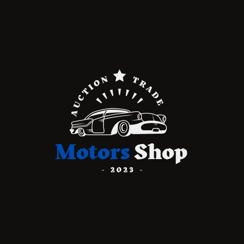

<h1 align="center">
	
</h1>
 
<h3 align="center">
  Project Motors Shop
</h3>

<p align="center">
  <a href="#-project">Project</a>&nbsp;&nbsp;&nbsp;|&nbsp;&nbsp;&nbsp;
  <a href="#-technologies">Technologies</a>&nbsp;&nbsp;&nbsp;|&nbsp;&nbsp;&nbsp;
  <a href="#-layout">Layout</a>&nbsp;&nbsp;&nbsp;|&nbsp;&nbsp;&nbsp;
  <a href="#-how-to-use">How to use</a>&nbsp;&nbsp;&nbsp;
</p>

<p align="center">
  

  

  

  
</p>

<br/>

## 💻 Project

Application developed for negotiations of cars and motorcycles in the auction mode, bringing an experience never seen before!

## 🚀 Technologies

This project was developed with the main following technologies:

- [React](https://reactjs.org/)
- [Styled Components](https://styled-components.com/)
- [React Hook Form](https://react-hook-form.com/)
- [Animate.css](https://animate.style/)
- [React Router DOM](https://reactrouter.com/en/main)
- [Axios](https://axios-http.com/docs/intro)
- [React Hot Toast](https://react-hot-toast.com/)
- [Yup](https://www.npmjs.com/package/yup)
- [React Icons](https://react-icons.github.io/react-icons/)
- [Class Transformer](https://github.com/typestack/class-transformer#readme)

## 🔖 Layout

You can view the layout of the project in the [web](https://www.figma.com/file/gEUjTK4ozBPNbJnqI8qZPH/M6---E-Commerce?node-id=45%3A2&t=OnczNyexQuFuSdl0-0). You need to have a [Figma](https://www.figma.com/) account to access it.

## 🧩 How to use

To clone and run this application, you'll need [git](https://git-scm.com), [yarn](https://classic.yarnpkg.com/lang/en/docs/). 
<br/>From your command line:

- [API Documentation](https://github.com/Motors-Shop-Grupo-16/motors-shop-api)

#### Clone the repository
```bash
$ git clone https://github.com/Motors-Shop-Grupo-16/motors-shop-front-end
```

### 🖥️ Web App

#### Go into the repository
```bash
$ cd motors-shop-front-end
```

#### Install dependencies
```bash
$ yarn
```

#### Run the application
```bash
$ yarn dev
```

#### Run tests
```bash
$ yarn test
```

---

### To see [Deploy](https://motors-shops-front.vercel.app/)

---

Made with ♥ by Motors-Shop-Grupo-16 - [Get in touch](https://github.com/Motors-Shop-Grupo-16)
